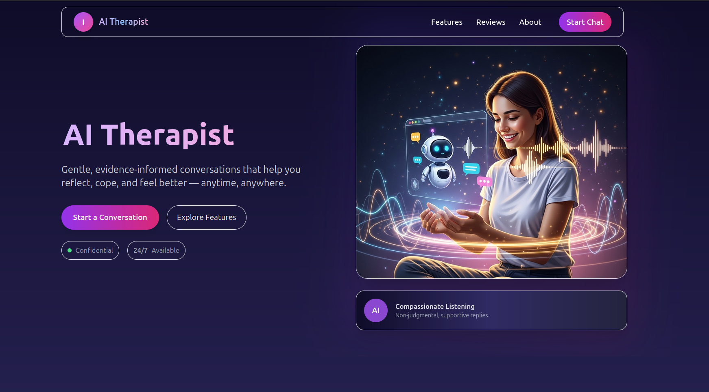

# 🧠 AI-Therapist

*An empathetic AI mental health companion for text and voice conversations — designed for privacy-first, session-based use.*

---

  
[🌐 Live Demo](https://ai-therapistt.netlify.app/)

---

## 🌟 Overview

**AI-Therapist** is a web-based mental health companion that enables users to engage in **empathetic conversations** via **chat or voice**.  
It is **not professional therapy**, but rather a **safe, private, and reflective space** where users can share their feelings without judgment.  

- **Privacy-first:** No databases, no permanent logs. All conversations live only in the session cache and vanish once closed.  
- **Empathy-focused:** Responses are designed to feel human, warm, and supportive rather than robotic.  
- **Voice & Text:** Supports natural speech in English and Indian languages.  
- **Accessible:** Works directly in the browser with no signup required.  

---

## ✨ Key Features

- **Anonymous Mode (implemented)**  
  - Start a conversation instantly, without identity or signup.  
  - Conversations exist only in the current browser session.  

- **Normal Mode (planned)**  
  - Optional mode to allow non-anonymous entry (not yet implemented).  

- **Voice + Text Interaction**  
  - Sarvam AI powers **text-to-speech (TTS)** for better Indian language audio output.  
  - Speech-to-text support for natural voice conversations.  

- **Therapist Personas**  
  - Multiple conversation styles (existential, crisis, reflection, emotions, boundaries).  
  - Adaptive responses with validation, reflection, and gentle probing.  

- **Crisis Safeguards**  
  - If severe distress indicators are present, the AI encourages contacting professional or emergency help (e.g., India: dial **112**).  

- **Privacy by Design**  
  - No database, no cloud storage.  
  - All memory is **session-based** — conversations disappear after closing the tab.  

---

## 🏗️ Tech Stack

- **Frontend:** React (Vite) + Tailwind CSS  
- **Backend:** FastAPI  
- **Model:** [GPT-OSS 20B](https://huggingface.co/), accessed via Hugging Face API  
- **Voice:** Sarvam AI TTS (for Indian languages)  
- **Session Handling:** Browser session storage (no persistent storage)  

---

## ⚙️ Installation & Setup

### 1. Clone the Repository
```bash
git clone <your-repo-link>
cd ai-therapist
```

### 2.Frontend setup
```bash
cd frontend
npm install
npm run dev
```

### 3.Backend setup
```bash
cd backend
pip install -r requirements.txt
uvicorn main:app --reload
        or
fastapi dev main.py
```

### 4. Environment Variables
  Create a .env file in backend/ with:
  ```ini
CORS_ALLOW_ORIGINS=http://localhost:5173
SARVAM_API_KEY=your_sarvam_api_key_here
HF_BASE_URL=https://router.huggingface.co/v1
HF_TOKEN=your_huggingface_token_here
HF_MODEL=gpt-oss-20b
```
## 🚨 Disclaimers

- **Not a substitute for professional help**  
  AI-Therapist is an empathy companion, not licensed therapy or medical advice.  
 

## 🔍 Known Limitations

- **Normal Mode incomplete**  
  Only anonymous mode works. This was intentional to prioritize privacy-first use.  

- **Latency risk**  
  GPT-OSS 20B can be slow on Hugging Face. No smaller fallback model yet.  
  
- **No persistent memory**  
  We deliberately avoid storing user data, even if it means sacrificing long-term tracking.  

---

## 👥 Contributing

We welcome contributions to improve AI-Therapist.  

1. Fork the repository and create a feature branch.  
2. Follow existing code style.  
3. Submit a PR with a clear description.  
4. Open issues for bugs, feature requests, or enhancements.  

---

## 📜 License

This project is licensed under the **MIT License** — free to use, modify, and distribute with attribution.  

See the [LICENSE](LICENSE) file for details.  


